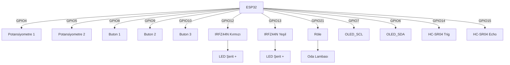
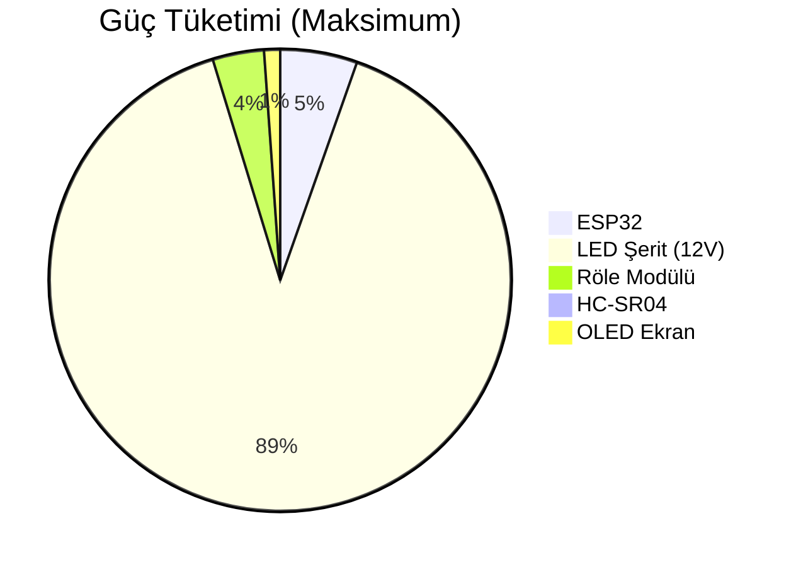
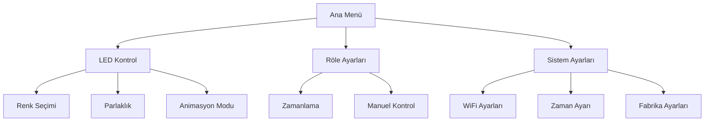

# 📌 RGB LED Şerit Kontrol Sistemi - Ultimate Kılavuz

## 🌟 Proje Hakkında Her Şey
Bu doküman, ESP32 tabanlı akıllı LED kontrol sisteminin tüm detaylarını içermektedir. Sistem şunları yapabilir:
- 🔌 2 kanallı PWM ile profesyonel LED kontrolü
- 🕒 Zaman ve hava durumuna göre otomatik modlar
- 📱 Hem fiziksel hem de web arayüzü ile kontrol
- 🏠 Oda varlık algılama ile enerji tasarrufu

## 🛠️ Donanım Detayları

### 🔧 Gerekli Bileşenler (Tam Liste)
| Bileşen | Miktar | Notlar |
|---------|--------|--------|
| ESP32 DevKit v1 | 1 | Diğer versiyonlar da çalışır |
| IRFZ44N MOSFET | 2 | LED şeritler için |
| 5V Röle Modülü | 1 | Oda aydınlatması için |
| HC-SR04 | 1 | Mesafe ölçümü |
| 128x64 OLED | 1 | I2C arayüz |
| 10K Potansiyometre | 2 | Analog kontrol |
| Buton | 3 | Momentary tip |
| 1N4007 Diyot | 2 | Gerilim koruma |
| 10K Direnç | 5 | Pull-up/down için |
| 100Ω Direnç | 2 | LED koruma |
| Breadboard | 1 | Prototip için |
| Jumper Kablolar | 20+ | Bağlantılar için |

### 🎛️ Detaylı Pin Bağlantı Şeması


### ⚡ Güç Yönetimi


## 💾 Yazılım Kurulumu - Adım Adım

### 📥 Gerekli Kütüphaneler (Tam Liste)
1. **Temel Kütüphaneler**:
   - `Adafruit_GFX` (v1.10.12)
   - `Adafruit_SSD1306` (v2.5.7)
   - `WiFi` (v2.0.0)
   - `WebServer` (v2.0.0)

2. **Zaman Kütüphaneleri**:
   - `NTPClient` (v3.2.1)
   - `TimeLib` (v1.6.1)

3. **Hava Durumu**:
   - `ArduinoJson` (v6.19.4)
   - `HTTPClient` (v1.2)

4. **Ek Kütüphaneler**:
   - `EEPROM` (v2.0.0) - Ayarların saklanması için
   - `ESP32PWM` (v1.0.0) - Gelişmiş PWM kontrolü

### ⚙️ Kod Yapısı (Detaylı)
```plaintext
/project_root
│── /data
│   ├── config.json       # Sistem ayarları
│   └── schedule.json     # Zamanlama ayarları
│── /lib
│   ├── UI_Manager       # OLED arayüz kodu
│   ├── LED_Controller   # PWM kontrol sınıfı
│   └── Sensor_Manager   # HC-SR04 işlemleri
│── main.ino             # Ana program
└── settings.h           # Tüm ayarlar
```

### 🔄 Flashing İşlemi (Detaylı)
1. Arduino IDE'de:
   - Tools > Board > ESP32 Dev Module
   - Flash Mode: "QIO"
   - Flash Size: "4MB (32Mb)"
   - Partition Scheme: "Default 4MB"

2. Özel ayarlar:
   ```cpp
   #define SERIAL_DEBUG true  // Hata ayıklama için
   #define WIFI_SSID "YourSSID"
   #define WIFI_PASS "YourPassword"
   #define OWM_API_KEY "YourAPIKey"
   ```

## 🎛️ Sistem Özellikleri - Ultimate Detaylar

### 💡 LED Kontrol Sistemi
- **PWM Özellikleri**:
  - 8-bit çözünürlük (0-255)
  - 1KHz PWM frekansı
  - Soft-start özelliği (ani açılmayı önler)

- **Renk Modları**:
  ```cpp
  enum ColorModes {
    SOLID,          // Sabit renk
    FADE,           // Yavaş geçiş
    STROBE,         // Stroboskopik
    WEATHER_SYNC,   // Hava durumu senkronizasyonu
    MUSIC_MODE      // Ses duyarlı (gelecek sürüm)
  };
  ```

### ⏱️ Zamanlayıcı Sistemi

```mermaid
gantt
    title Günlük Zamanlama
    dateFormat  HH:mm
    section Aydınlatma
    Otomatik Mod : 19:00, 07:00
    section LED
    Gündüz Modu : 08:00, 18:00
    Akşam Modu : 18:00, 22:00
    Gece Modu : 22:00, 08:00
```


### 🌤️ Hava Durumu Entegrasyonu
- OpenWeatherMap API kullanır
- Ankara için özel sorgu:
  ```http
  GET https://api.openweathermap.org/data/2.5/weather?q=Ankara,TR&appid=YOUR_API_KEY&units=metric&lang=tr
  ```
- Yanıt örneği:
  ```json
  {
    "weather":[{
      "id":800,
      "main":"Clear",
      "description":"açık",
      "icon":"01d"
    }],
    "main":{
      "temp":22.5,
      "humidity":40
    }
  }
  ```

## 🖥️ Kullanıcı Arayüzü - Ultimate Kılavuz

### 📺 OLED Menü Yapısı


### 🕹️ Buton Kontrolleri (Detaylı)
| Buton | Tek Tık | Çift Tık | Uzun Basış |
|-------|---------|----------|------------|
| BTN1  | Menüde aşağı | Röle kontrolü | Sistem kapanış |
| BTN2  | Menüde yukarı | PWM ayarları | WiFi ayarları |
| BTN3  | Seçim onayı | Animasyon modu | Yeniden başlat |

### 🌐 Web Arayüzü Özellikleri
- **Endpointler**:
  ```
  /api/v1/
  ├── /led          # LED kontrol
  ├── /relay        # Röle kontrol
  ├── /sensor      # HC-SR04 verisi
  └── /system      # Sistem bilgisi
  ```

- **Örnek Kullanım**:
  ```bash
  # LED kontrolü
  curl -X POST http://192.168.1.100/api/v1/led \
    -H "Content-Type: application/json" \
    -d '{"red":255, "green":120, "blue":0, "mode":"fade"}'
  ```

## 🔧 Sorun Giderme - Ultimate Rehber

### 🚨 Sık Karşılaşılan Sorunlar
1. **LED'ler yanmıyor**:
   - MOSFET gate direnci kontrolü (10K-100Ω)
   - 12V güç kaynağı yeterli mi?
   - PWM frekansını düşürün (500Hz deneyin)

2. **HC-SR04 hatalı ölçüm**:
   ```cpp
   // Doğru ayar:
   #define TRIG_PULSE 10  // 10μs tetikleme
   #define MAX_DISTANCE 400 // Maksimum 4m
   ```

3. **WiFi bağlantı sorunu**:
   - `WiFi.mode(WIFI_STA);` kullanın
   - Kanal ayarı:
     ```cpp
     WiFi.begin(ssid, password, 6); // Kanal 6
     ```

### 📊 Test Komutları (Serial Monitor)
```bash
# Sistem bilgisi
> SYSTEM INFO

# LED testi
> LED TEST RED 255

# Röle testi
> RELAY TOGGLE

# Sensör testi
> SENSOR READ
```

## 📈 Gelişmiş Ayarlar

### ⚙️ EEPROM Yapılandırması
| Adres | Veri | Boyut |
|-------|------|-------|
| 0x00  | WiFi SSID | 32 byte |
| 0x20  | WiFi Pass | 64 byte |
| 0x60  | LED Ayarları | 16 byte |
| 0x70  | Zamanlama | 32 byte |

### 🔄 OTA Güncelleme
1. `ArduinoOTA` kütüphanesini ekleyin
2. Ayarlar:
   ```cpp
   ArduinoOTA
     .onStart([]() {
       Serial.println("OTA Start");
     })
     .setPassword("ota123");
   ```

## 📜 Lisans ve Katkı
- **Lisans**: GNU GPLv3
- **Katkı**:
  - Fork & Pull Request modeli
  - Kod stili: Google C++ Style Guide
  - Testler: PlatformIO unit test

## 📞 İletişim ve Destek
- **E-posta**: support@ledcontrolproject.com
- **Discord**: https://discord.gg/ledcontrol
- **Hata Takibi**: GitHub Issues

---

Bu doküman projenin tüm detaylarını kapsamaktadır. Güncellemeler için proje GitHub sayfasını takip edin:  
🔗 [GitHub Repository](https://github.com/yourusername/led-control-system)
