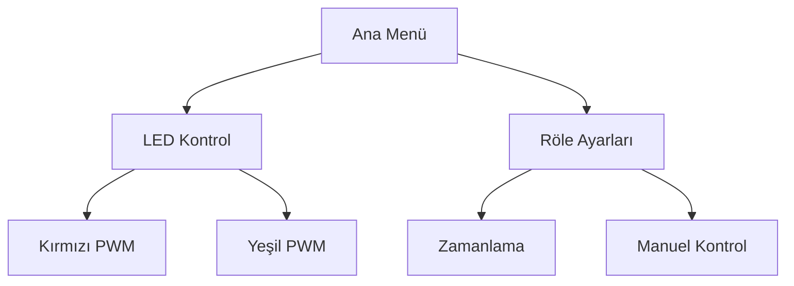

```markdown
# 🚀 RGB LED Şerit Kontrol Sistemi - ESP32


## 📌 Proje Özeti
ESP32 ile geliştirilen bu sistem, profesyonel RGB LED şeritlerin ve oda aydınlatmasının akıllı kontrolünü sağlar. HC-SR04 sensörü, OLED ekran ve fiziksel butonlarla tam entegre çalışır.

## 🛠️ Donanım Bağlantıları
```cpp
#define POT1 4      // GPIO4 (Analog Giriş)
#define POT2 5      // GPIO5 (Analog Giriş)
#define BTN1 8      // GPIO8 (Pull-up)
#define BTN2 9      // GPIO9 (Pull-up)
#define BTN3 10     // GPIO10 (Pull-up)
#define MOSFET1 12  // GPIO12 (PWM Çıkış)
#define MOSFET2 13  // GPIO13 (PWM Çıkış)
#define RELAY1 21   // GPIO21 (Dijital Çıkış)
#define OLED_SCL 7  // GPIO7 (I2C Clock)
#define OLED_SDA 6  // GPIO6 (I2C Data)
#define TRIG 14     // GPIO14 (HC-SR04 Trig)
#define ECHO 15     // GPIO15 (HC-SR04 Echo)
```

## 📥 Kurulum
### Gerekli Kütüphaneler
```bash
platformio lib install "Adafruit GFX Library"
platformio lib install "Adafruit SSD1306"
platformio lib install "NTPClient"
platformio lib install "ArduinoJson"
```

### Yazılım Yükleme
1. Arduino IDE'de:
   - Dosya > Örnekler > ESP32 > PWM örneğini açın
2. Aşağıdaki kodu ana programa ekleyin:
```cpp
void setup() {
  pinMode(MOSFET1, OUTPUT);
  pinMode(MOSFET2, OUTPUT);
  pinMode(RELAY1, OUTPUT);
  // Diğer kurulumlar...
}
```

## 🎛️ Kullanım Kılavuzu
### Buton Fonksiyonları
| Buton | Kısa Basma | Çift Tık | Uzun Basma (3sn) |
|-------|------------|----------|------------------|
| BTN1  | Menü Aşağı | Röle Aç/Kapa | Sistem Kapanış |
| BTN2  | Menü Yukarı | PWM Ayarları | WiFi Reset |
| BTN3  | Seçim Onay | Animasyon Modu | Yeniden Başlat |

### OLED Menü Yapısı


## 🌐 Web Arayüzü
Yerel ağda erişim:
```bash
http://<ESP_IP>/api/v1/led
```
Örnek JSON isteği:
```json
{
  "red": 255,
  "green": 100,
  "mode": "fade"
}
```

## ⚠️ Sorun Giderme
| Sorun | Çözüm |
|-------|-------|
| LED yanmıyor | MOSFET gate dirençlerini kontrol edin |
| HC-SR04 hatalı ölçüm | 5V bağlantısını ve topraklamayı kontrol edin |
| WiFi bağlanmıyor | `WiFi.begin(ssid, password, 6)` kanal ayarını deneyin |

## 📜 Lisans
MIT Lisansı - Detaylar için LICENSE dosyasına bakınız.

## 📞 İletişim
✉️ info@makerpcb.com.tr
🌍 [makerpcb.com.tr](https://makerpcb.com.tr)

---

> **Not:** Bu doküman proje versiyon V1.5 için geçerlidir. Son güncelleme: 06.04.2025
```
