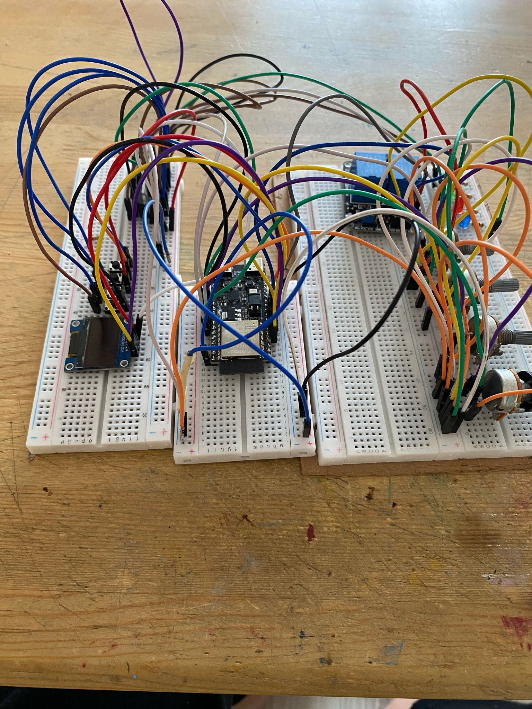

# 📌 RGB LED Strip Control System - Custom Project Guide

## 💾 YouTube Video
[YouTube Video](https://youtube.com/shorts/QAX4ULTzuk8)

## 🌟 Project Overview
This document details an ESP32-based RGB LED control system with the following capabilities:
- 🔌 2-channel PWM control for red and green LED strips
- 🕒 Automatic relay control after 19:00 based on Turkey/Istanbul time
- 📱 Web interface and physical button control
- 🏠 HC-SR04 presence detection for energy saving
- 🌤️ LED dance mode based on Turkey/Ankara weather conditions

## 🛠️ Hardware Details

### 🔧 Required Components
| Component            | Qty | Notes                      |
|----------------------|-----|----------------------------|
| ESP32 DevKit v1      | 1   | Other versions compatible  |
| IRFZ44N MOSFET       | 2   | For red and green LEDs     |
| 5V Relay Module      | 1   | Room light control         |
| HC-SR04              | 1   | Distance measurement       |
| 128x64 OLED (I2C)    | 1   | GPIO6 SDA, GPIO7 SCL       |
| 10K Potentiometer    | 2   | GPIO4 and GPIO5            |
| Button               | 3   | GPIO8, GPIO9, GPIO10       |
| 10K Resistor         | 5   | For pull-up                |
| Breadboard           | 1   | Prototyping                |
| Jumper Wires         | 20+ | For connections            |

### 🎛️ Pin Connection Diagram


### ⚡ Power Management


## 💾 Software Installation

### 📥 Required Libraries
1. **Core Libraries**:
   - `Adafruit_GFX` (v1.10.12)
   - `Adafruit_SSD1306` (v2.5.7)
   - `WiFi` (v2.0.0)
   - `ESPAsyncWebServer` (v3.1.0)

2. **Time and Weather**:
   - `NTPClient` (v3.2.1)
   - `ArduinoJson` (v6.19.4)
   - `HTTPClient` (v1.2)

### ⚙️ Code Structure (Detailed)
```plaintext
/RGB-Control-System-with-ESP32-C6
├── /web-server
│   ├── config.php
│   ├── connect.php
│   ├── color.php
│   └── relay.php
├── /includes
│   └── functions.php
└── index.php
│── /src
│   ├── main.ino
└── ├── settings.h
```

### 🔄 Flashing Process
1. In Arduino IDE:
   - Tools > Board > ESP32 Dev Module
   - Flash Mode: "QIO"
   - Flash Size: "4MB (32Mb)"
   - Partition Scheme: "Default 4MB"

2. Custom settings:
   ```cpp
   #define WIFI_SSID "YourSSID"
   #define WIFI_PASS "YourPassword"
   #define OWM_API_KEY "YourAPIKey"
   ```

## 🎛️ System Features

### 💡 LED Control System
- **PWM Specifications**:
  - 8-bit resolution (0-255)
  - 5kHz PWM frequency
- **Control**:
  - POT1 for red LED adjustment
  - POT2 for green LED adjustment

### ⏱️ Timing System
- Turkey/Istanbul timezone (GMT+3)
- Relay activates after 19:00 based on HC-SR04 data:
  - Person in room: ON
  - Person leaves: OFF

### 🌤️ Weather Integration
- Ankara weather (OpenWeatherMap API):
  ```http
  GET https://api.openweathermap.org/data/2.5/weather?q=Ankara,TR&appid=YOUR_API_KEY&units=metric&lang=en
  ```
- BTN3 dance mode: LEDs synchronize based on weather conditions.

## 🖥️ User Interface

### 📺 OLED Menu Structure


### 🕹️ Button Controls
| Button | Single Click     | Double Click        | Usage                    |
|--------|------------------|---------------------|--------------------------|
| BTN1   | Menu down        | Relay status        | POT1 value adjustment    |
| BTN2   | Menu up          | MOSFET status       | POT1 value adjustment    |
| BTN3   | Confirm selection | Dance mode          | Toggle operations        |

### 🌐 Web Interface
- **Endpoints**:
  ```
  /           # Homepage
  /relay/on   # Relay on
  /relay/off  # Relay off
  ```

## 🔧 Troubleshooting - Ultimate Guide

### 🚨 Common Issues
1. **LEDs not lighting**:
   - Check MOSFET gate resistor (10K-100Ω)
   - Verify 12V power supply adequacy
   - Reduce PWM frequency (try 500Hz)

2. **HC-SR04 incorrect measurements**:
   ```cpp
   // Correct settings:
   #define TRIG_PULSE 10  // 10μs trigger pulse
   #define MAX_DISTANCE 400 // Maximum 4m
   ```

3. **WiFi connection issues**:
   - Use `WiFi.mode(WIFI_STA);`
   - Channel setting:
     ```cpp
     WiFi.begin(ssid, password, 6); // Channel 6
     ```

### 📊 Test Commands (Serial Monitor)
```bash
# System info
> SYSTEM INFO

# LED test
> LED TEST RED 255

# Relay test
> RELAY TOGGLE

# Sensor test
> SENSOR READ
```

## 📈 Advanced Settings

### ⚙️ EEPROM Configuration
| Address | Data       | Size    |
|---------|------------|---------|
| 0x00    | WiFi SSID  | 32 byte |
| 0x20    | WiFi Pass  | 64 byte |
| 0x60    | LED Settings | 16 byte |
| 0x70    | Timing     | 32 byte |

## 📜 License
- **License**: CERN-OHL-S-2.0

## 🤝 Our Sponsors  

<div align="center">
  
  <h2>⚡ Elecrow - The Ultimate Electronics Manufacturing Partner for Makers Worldwide</h2>
</div>

### 🌟 Why Elecrow Powered Our Project
As the backbone of our hardware supply chain, Elecrow delivered:
- **Mission-critical components**: IRFZ44N MOSFETs, 10K resistors, HC-SR04 sensors
- **Lightning-fast logistics**: 72-hour emergency delivery for prototyping phases
- **Engineer-to-engineer support**: Customized circuit design recommendations

### 🛠️ Elecrow's Complete Ecosystem
| Service | Capabilities | Maker Advantages |
|---------|--------------|------------------|
| **PCB Fabrication** | 2-16 layer boards | <ul><li>5 free prototype boards</li><li>24h rapid turnaround</li></ul> |
| **Component Store** | 10,000+ parts | <ul><li>Competitive pricing</li><li>Verified quality control</li></ul> |
| **Full Assembly** | SMT & THT | <ul><li>One-stop solution</li><li>Robotic precision</li></ul> |

### 💎 Exclusive Perks for Our Community
```markdown
- [ ] **NEW20** → 20% off first order
- [ ] **FREESHIP** → Free shipping over $150
- [ ] **ASK10** → 10 free consulting minutes
```

### 🏆 Testimonial
> "When our MOSFETs failed during testing, Elecrow's team **personally hand-selected** replacement units and expedited shipping. This level of care makes them the **unsung hero of hardware startups**."  
> **— RGB-Control-System-with-ESP32-C6**, Project Lead

<div align="center">
  <h3>Connect With Elecrow</h3>
  <p>
    <a href="https://www.elecrow.com" target="_blank">🌐 Official Site</a> | 
    <a href="mailto:support@elecrow.com">✉️ Support</a> | 
    <a href="https://linkedin.com/company/elecrow" target="_blank">💼 LinkedIn</a>
  </p>
  
  <p><em>Elecrow's engineering team reviewing our project requirements</em></p>
</div>

---

### 🔍 Explore Further
- [x] **[Component Catalog PDF](https://www.elecrow.com/docs/catalog2023.pdf)**  
- [x] **[Live Assembly Line Webcam](https://www.elecrow.com/factory-tour)**  
- [x] **[Maker Success Stories](https://blog.elecrow.com/case-studies)**

---

**🛡️ Trust Indicators:**  
✔ ISO 9001 & UL Certified  
✔ PayPal & Escrow Protection  
✔ 365-Day Quality Warranty  

**#ElecrowHeroes #HardwareMadeEasy #MakerMovement**  

---

**Pro Tip:** Show this badge on your project enclosure to get VIP treatment on future orders:  
  

## 📞 Contact & Support
- **Email**: info@makerpcb.com.tr
- **Website**: https://makerpcb.com.tr
- **Issue Tracking**: GitHub Issues

## 📷 Board & Project Images





---

This document covers all project details. Follow the project GitHub page for updates:  
🔗 [GitHub Repository](https://github.com/hamzadenizyilmaz/RGB-Control-System-with-ESP32-C6)

Project Versiyon: V1.5
