# 📌 RGB LED Şerit Kontrol Sistemi - Projenize Özel Kılavuz

## 🌟 Proje Hakkında
Bu doküman, ESP32 tabanlı bir RGB LED kontrol sisteminin detaylarını içerir. Sistem şunları yapabilir:
- 🔌 2 kanallı PWM ile kırmızı ve yeşil LED şerit kontrolü
- 🕒 Türkiye/İstanbul saatine göre 19:00 sonrası otomatik röle kontrolü
- 📱 Web arayüzü ve fiziksel butonlarla kontrol
- 🏠 HC-SR04 ile varlık algılama ve enerji tasarrufu
- 🌤️ Türkiye/Ankara hava durumuna göre LED dans modu

## 📷 Kart ve Proje Görselleri

## 🛠️ Donanım Detayları

### 🔧 Gerekli Bileşenler
| Bileşen            | Miktar | Notlar                     |
|--------------------|--------|----------------------------|
| ESP32 DevKit v1    | 1      | Diğer versiyonlar da olur  |
| IRFZ44N MOSFET     | 2      | Kırmızı ve yeşil LED için  |
| 5V Röle Modülü     | 1      | Oda ışığı kontrolü         |
| HC-SR04            | 1      | Mesafe ölçümü              |
| 128x64 OLED (I2C)  | 1      | GPIO6 SDA, GPIO7 SCL       |
| 10K Potansiyometre | 2      | GPIO4 ve GPIO5             |
| Buton              | 3      | GPIO8, GPIO9, GPIO10       |
| 10K Direnç         | 5      | Pull-up için               |
| Breadboard         | 1      | Prototip                   |
| Jumper Kablolar    | 20+    | Bağlantılar için           |

### 🎛️ Pin Bağlantı Şeması

```mermaid
graph TD;
    ESP32-->|GPIO4|POT1[Potansiyometre 1];
    ESP32-->|GPIO5|POT2[Potansiyometre 2];
    ESP32-->|GPIO8|BTN1[Buton 1];
    ESP32-->|GPIO9|BTN2[Buton 2];
    ESP32-->|GPIO10|BTN3[Buton 3];
    ESP32-->|GPIO12|MOSFET1[IRFZ44N Kırmızı];
    ESP32-->|GPIO13|MOSFET2[IRFZ44N Yeşil];
    ESP32-->|GPIO21|RELAY1[Röle];
    ESP32-->|GPIO7|OLED_SCL[OLED SCL];
    ESP32-->|GPIO6|OLED_SDA[OLED SDA];
    ESP32-->|GPIO14|TRIG[HC-SR04 Trig];
    ESP32-->|GPIO15|ECHO[HC-SR04 Echo];
    MOSFET1-->LED1[Kırmızı LED Şerit];
    MOSFET2-->LED2[Yeşil LED Şerit];
    RELAY1-->LIGHT[Oda Işığı];
```


### ⚡ Güç Yönetimi

```mermaid
pie
    title Güç Tüketimi (Maksimum)
    "ESP32" : 120
    "LED Şerit (12V)" : 2000
    "Röle Modülü" : 80
    "HC-SR04" : 15
    "OLED Ekran" : 25
```


## 💾 Yazılım Kurulumu

### 📥 Gerekli Kütüphaneler
1. **Temel Kütüphaneler**:
   - `Adafruit_GFX` (v1.10.12)
   - `Adafruit_SSD1306` (v2.5.7)
   - `WiFi` (v2.0.0)
   - `ESPAsyncWebServer` (v3.1.0)

2. **Zaman ve Hava Durumu**:
   - `NTPClient` (v3.2.1)
   - `ArduinoJson` (v6.19.4)
   - `HTTPClient` (v1.2)

### ⚙️ Kod Yapısı (Detaylı)
```plaintext
/RGB-Control-System-with-ESP32-C6
├── /web-server
│   ├── config.php
│   ├── connect.php
│   ├── color.php
│   └── relay.php
├── /includes
│   └── functions.php
└── index.php
│── /src
│   ├── main.ino
└── ├── settings.h
```
### 🔄 Flashing İşlemi
1. Arduino IDE'de:
   - Tools > Board > ESP32 Dev Module
   - Flash Mode: "QIO"
   - Flash Size: "4MB (32Mb)"
   - Partition Scheme: "Default 4MB"

2. Özel ayarlar:
   ```cpp
   #define WIFI_SSID "YourSSID"
   #define WIFI_PASS "YourPassword"
   #define OWM_API_KEY "YourAPIKey"
   ```

## 🎛️ Sistem Özellikleri

### 💡 LED Kontrol Sistemi
- **PWM Özellikleri**:
  - 8-bit çözünürlük (0-255)
  - 5kHz PWM frekansı
- **Kontrol**:
  - POT1 ile kırmızı LED ayarı
  - POT2 ile yeşil LED ayarı

### ⏱️ Zamanlayıcı Sistemi
- Türkiye/İstanbul saat dilimi (GMT+3)
- Röle, 19:00 sonrası HC-SR04 verisine göre açılır/kapanır:
  - Kişi odada: Açık
  - Kişi çıkarsa: Kapalı

### 🌤️ Hava Durumu Entegrasyonu
- Ankara hava durumu (OpenWeatherMap API):
  ```http
  GET https://api.openweathermap.org/data/2.5/weather?q=Ankara,TR&appid=YOUR_API_KEY&units=metric&lang=tr
  ```
- BTN3 ile dans modu: Hava durumuna göre LED'ler senkronize hareket eder.

## 🖥️ Kullanıcı Arayüzü

### 📺 OLED Menü Yapısı

```mermaid
graph TD;
    A[Ana Menü] --> B[LED Değerleri];
    A --> C[Röle Durumu];
    A --> D[MOSFET Durumu];
    B --> B1[Kırmızı: 0-255];
    B --> B2[Yeşil: 0-255];
    C --> C1[Aç/Kapa];
    D --> D1[PWM Ayarı];
    D --> D2[Aç/Kapa];
```


### 🕹️ Buton Kontrolleri
| Buton | Tek Tık         | Çift Tık            | Kullanım                  |
|-------|-----------------|---------------------|---------------------------|
| BTN1  | Menüde aşağı    | Röle durumu         | POT1 ile değer değişimi   |
| BTN2  | Menüde yukarı   | MOSFET durumu       | POT1 ile değer değişimi   |
| BTN3  | Seçim onayı     | Dans modu           | Aç/Kapa işlemleri         |

### 🌐 Web Arayüzü
- **Endpointler**:
  ```
  /           # Ana sayfa
  /relay/on   # Röle aç
  /relay/off  # Röle kapat
  ```

## 🔧 Sorun Giderme - Ultimate Rehber

### 🚨 Sık Karşılaşılan Sorunlar
1. **LED'ler yanmıyor**:
   - MOSFET gate direnci kontrolü (10K-100Ω)
   - 12V güç kaynağı yeterli mi?
   - PWM frekansını düşürün (500Hz deneyin)

2. **HC-SR04 hatalı ölçüm**:
   ```cpp
   // Doğru ayar:
   #define TRIG_PULSE 10  // 10μs tetikleme
   #define MAX_DISTANCE 400 // Maksimum 4m
   ```

3. **WiFi bağlantı sorunu**:
   - `WiFi.mode(WIFI_STA);` kullanın
   - Kanal ayarı:
     ```cpp
     WiFi.begin(ssid, password, 6); // Kanal 6
     ```

### 📊 Test Komutları (Serial Monitor)
```bash
# Sistem bilgisi
> SYSTEM INFO

# LED testi
> LED TEST RED 255

# Röle testi
> RELAY TOGGLE

# Sensör testi
> SENSOR READ
```

## 📈 Gelişmiş Ayarlar

### ⚙️ EEPROM Yapılandırması
| Adres | Veri | Boyut |
|-------|------|-------|
| 0x00  | WiFi SSID | 32 byte |
| 0x20  | WiFi Pass | 64 byte |
| 0x60  | LED Ayarları | 16 byte |
| 0x70  | Zamanlama | 32 byte |

## 📜 Lisans
- **Lisans**: CERN-OHL-S-2.0

## 🤝 Sponsorlarımız

## 📞 İletişim ve Destek
- **E-posta**: info@makerpcb.com.tr
- **Web Site**: https://makerpcb.com.tr
- **Hata Takibi**: GitHub Issues

---

Bu doküman projenin tüm detaylarını kapsamaktadır. Güncellemeler için proje GitHub sayfasını takip edin:  
🔗 [GitHub Repository]([https://github.com/yourusername/led-control-system](https://github.com/hamzadenizyilmaz/RGB-Control-System-with-ESP32-C6))
